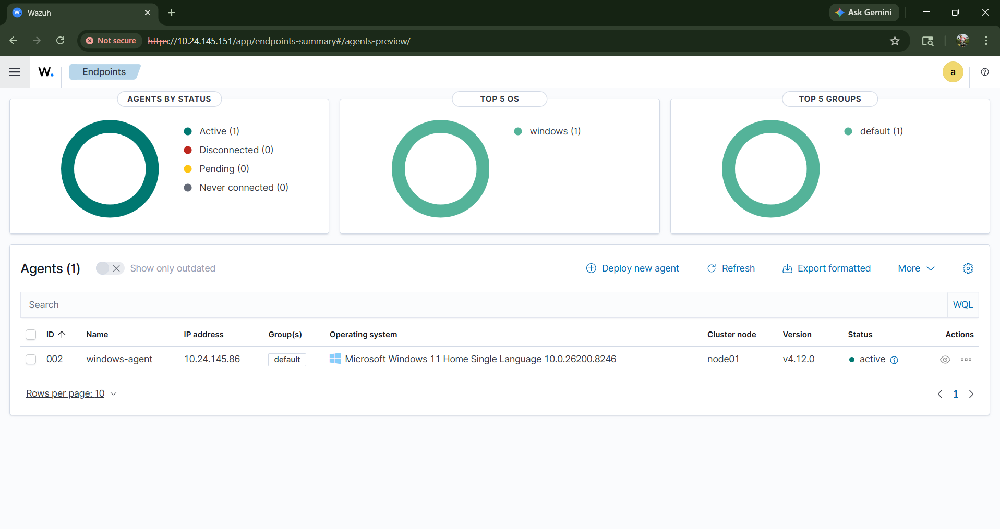
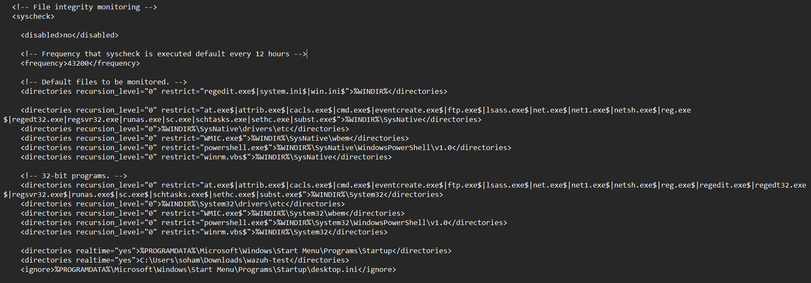
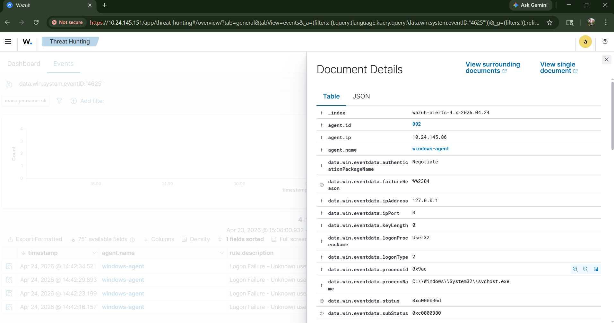
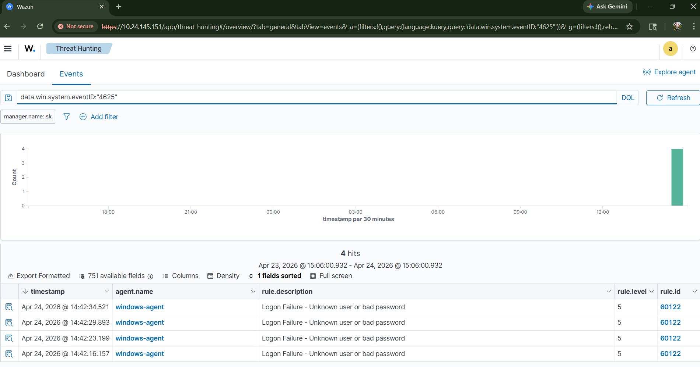

# 🛡️ Wazuh SIEM - Enterprise SOC Home Lab

## 📖 Objective
The objective of this project was to engineer a local Security Information and Event Management (SIEM) environment to ingest, parse, and analyze security telemetry from a Windows endpoint. This lab focuses on real-time threat detection, endpoint configuration, and mapping adversarial behavior to the MITRE ATT&CK framework.

## 🛠️ Tools & Environment
* **SIEM:** Wazuh (Manager & Agent)
* **Hypervisor:** Oracle VM VirtualBox
* **Operating Systems:** Ubuntu Server (Manager), Windows 11 (Endpoint)
* **Techniques:** Log Analysis, File Integrity Monitoring (FIM), Threat Hunting

---

## 🚀 Phase 1: Architecture & Agent Deployment
The foundational step involved deploying the Wazuh Manager on an Ubuntu virtual machine and provisioning a Windows 11 endpoint with the Wazuh Agent. I configured the network settings to ensure secure, real-time communication between the endpoint and the SIEM manager.

*Ref: Successful connection and active status of the Windows 11 endpoint.*

---

## 🔒 Phase 2: File Integrity Monitoring (FIM)
To simulate defense against insider threats and ransomware, I configured the Wazuh agent to monitor critical directories in real time. 
* **Configuration:** I edited the `ossec.conf` XML file on the Windows endpoint, elevating the standard periodic scans to real-time monitoring for a specific target folder.
* **Validation:** Creating, modifying, and deleting files within the monitored directory successfully triggered Level 7 Alerts in the SIEM.

*Ref: Custom XML configuration enabling real-time directory monitoring.*

*Ref: Wazuh dashboard capturing the exact moment the file integrity checksum changed.*

---

## 🚨 Phase 3: Threat Hunting & Brute Force Detection
To demonstrate incident response capabilities, I simulated a credential-stuffing/brute-force attack against the Windows endpoint.
* **Execution:** Generated multiple failed login attempts on the lock screen.
* **Triage & Analysis:** Queried the Wazuh Security Events dashboard to hunt for the specific telemetry. 
* **Findings:** Successfully identified **Windows Event ID 4625** (Audit Failure). The SIEM parsed the raw JSON logs, identified the `targetUserName`, and correctly mapped the attack pattern to **MITRE ATT&CK T1110 (Brute Force)**.

*Ref: Triage of Event ID 4625 showing the parsed logon data and MITRE ATT&CK mapping.*

---

## 💡 Key Takeaways
This lab provided hands-on experience in the daily responsibilities of a SOC Analyst. It reinforced my ability to move beyond basic dashboard monitoring and directly engineer endpoint configurations, query raw JSON telemetry, and validate threat intelligence mappings.
